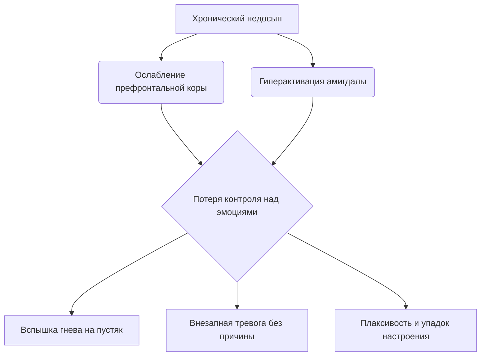

# Хронический [недосып](../../../3.1. healthy lifestyle/Sleep, nutrition, and adolescent energy/articles/chronic_sleep_deprivation.md): Скрытые последствия для психики

Кажется, что пропустить пару часов сна — не проблема. «Отосплюсь в [выходные](../../../3.1. healthy lifestyle/Sleep, nutrition, and adolescent energy/articles/social_jetlag_and_monday_morning.md)» — говоришь ты, листая ленту в 2 часа ночи. Но [организм](../../../1.2_natural_sciences/why_science_help_understand_world/organism.md) так не работает. Он ведет учет, и этот учет называется **хронической депривацией сна**.

Если ты систематически спишь меньше 7–8 часов, твой [мозг](../../../3.1. healthy lifestyle/Sleep, nutrition, and adolescent energy/articles/breakfast_for_the_brain.md) начинает работать в аварийном режиме. И дело не только в темных кругах под глазами. Речь идет о [том](../../../7.1_art/musical_instruments/articles/drums.md), как ты чувствуешь себя эмоционально: твоя [тревожность]("./articles/stress_and_food.md"), раздражительность и внезапная грусть имеют прямую [связь](../../../2.1_society/cause_and_effect_relationships/articles/causality_base.md) с кроватью.

> ### 🛑 Рубрика «Миф vs Реальность»
>
> **1. Про привыкание**  
> 🔴 *Миф:* «Мой организм привык [спать](../../../how_to_memorize/articles/son.md) по 5 часов, мне хватает».  
> 🟢 *Реальность:* Твой организм привык *выживать* на 5 часах сна. Твоя [продуктивность](../../../3.1. healthy lifestyle/Sleep, nutrition, and adolescent energy/articles/ideal_schedule_energy_management.md) и [настроение](../../../8.1_entertainment/articles/psychology_of_music.md) всё равно ниже твоего же реального потенциала.
>
> **2. Про [эмоции](../../../3.1. healthy lifestyle/Sleep, nutrition, and adolescent energy/articles/stress_and_food.md)**  
> 🔴 *Миф:* «Я злюсь, потому что день не задался».  
> 🟢 *Реальность:* Скорее всего, ты злишься, потому что не выспался. Недосып делает негативные эмоции в 2 раза интенсивнее.

## Почему без сна всё бесит?

В твоем мозге есть две важные структуры: **миндалевидное [тело](../../../1.2_natural_sciences/why_science_help_understand_world/organism.md)** (центр страха и тревоги) и **префронтальная кора** (центр логики и самоконтроля). Когда ты высыпаешься, префронтальная кора успешно тормозит миндалину, не давая панике разгораться.

Когда ты не спишь, префронтальная кора «отключается» быстрее остальных отделов. А миндалевидное тело, наоборот, переходит в [режим](../../../5.1_technology_and_digital_literacy/information and media literacy/семейные_правила_потребления_контента.md) гиперчувствительности.

# [Химия](../../../1.2_natural_sciences/why_science_help_understand_world/natural_sciences.md) усталости: Кортизол vs [Мелатонин](../../../3.1. healthy lifestyle/Sleep, nutrition, and adolescent energy/articles/biology_of_night_owls_teens.md)

Когда ты не спишь, тело думает, что наступила катастрофа (ведь ночью наши предки не бодрствовали просто так — только если была [угроза](../../../5.1_technology_and_digital_literacy/information and media literacy/информационная_безопасность_для_детей.md)). В кровь выбрасывается гормон стресса — **кортизол**.

В норме кортизол высок с утра (чтобы проснуться) и [низкий](../../../7.1_art/musical_instruments/articles/bassoon.md) ночью (чтобы уснуть). При недосыпе он остается высоким и ночью. Это создает эффект «загнанного зверя»: ты уставший, но при этом напряженный и дерганый. Ты хочешь отдохнуть, но твое тело находится в состоянии войны.

## Чек-лист: Твоя психика под ударом (красные флаги)

Если ты мало спишь и замечаешь у себя эти [симптомы](../../../4.2/critical_thinking/articles/problem_structuring.md), дело не в «сложном возрасте», а в банальной нехватке сна.

- **Катастрофизация.** Ты получил(а) тройку? «Всё, моя [жизнь](../../../1.2_natural_sciences/why_science_help_understand_world/biology.md) кончена, я нищий неудачник». Мозг недосыпающего не видит полутонов.
- **Социальная [тревога](../../../how_to_memorize/articles/stress.md).** Тебе кажется, что все на тебя смотрят и обсуждают. На самом деле, это просто уставший мозг ищет [опасность](../../../3.1_healthy_lifestyle/pervaya_pomoshch/ushibi_porezy_ozhogi/06_ushib_kogda_vrach.md) там, где ее нет.
- **Эмоциональные качели.** Смех сменяется слезами за 5 минут. Твой эмоциональный тормоз не работает.

## 😂 Анекдот от GPT по теме

Встречаются два нейрона в голове у подростка.  
— Слышал, хозяин опять спать ложится в 3 утра.  
— Да, готовься, завтра с утра устроим ему паническую атаку из-за сообщения в чате. Пусть знает, что с нами так [нельзя](../../../3.1_healthy_lifestyle/pervaya_pomoshch/ushibi_porezy_ozhogi/07_ushib_chego_nelzya.md)!

---
**[Автор](../../../5.1_technology_and_digital_literacy/information and media literacy/авторское_право_и_честное_использование.md):** Ткаченко Елизавета  
**Нейронные сети, использованные при создании статьи:** OpenAI GPT-4o, Google Gemini 1.5 Pro
