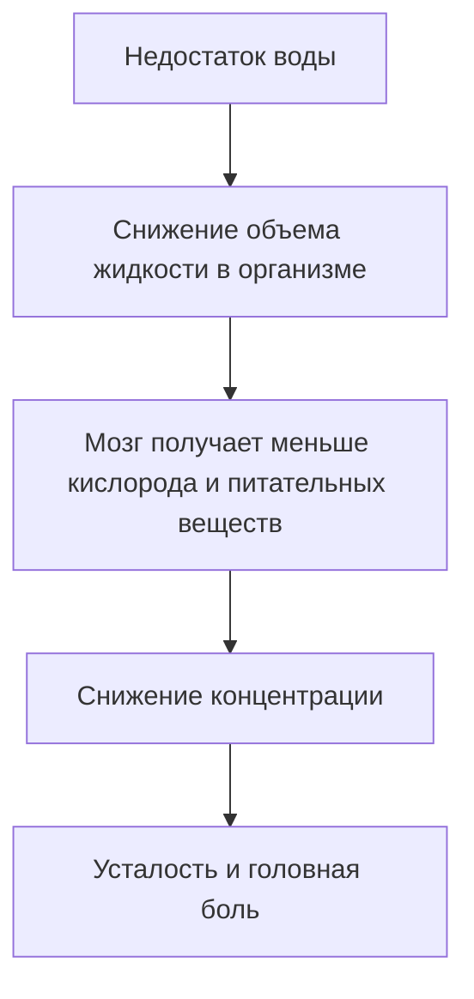
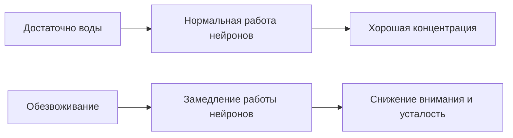

# [Питьевой режим](../../../3.1. healthy lifestyle/Sleep, nutrition, and adolescent energy/articles/drinking_regime.md): почему [вода](../../../3.1. healthy lifestyle/Sleep, nutrition, and adolescent energy/articles/drinking_regime.md) — самый простой способ стать бодрее

Ты когда-нибудь чувствовал странную [усталость](../../../3.1. healthy lifestyle/Sleep, nutrition, and adolescent energy/articles/sugar_rollercoaster.md) посреди дня?  
Голова начинает немного болеть, становится трудно [сосредоточиться](../../../how_to_memorize/articles/koncentraciya.md), а [мозг](../../../3.1. healthy lifestyle/Sleep, nutrition, and adolescent energy/articles/breakfast_for_the_brain.md) будто работает медленнее.

Часто первая мысль — **нужно [больше кофе]("./articles/the_energy_trap.md") или сладкого**.  
Но иногда [причина](../../../2.1_society/cause_and_effect_relationships/articles/causality_base.md) гораздо проще: **организму просто не хватает воды**.

Даже лёгкое обезвоживание может заметно повлиять на работу мозга, [уровень](../../../8.1_entertainment/articles/gamification.md) энергии и самочувствие.

Разберёмся, почему вода играет такую важную роль и как она помогает чувствовать себя бодрее.

>### 🛑 Рубрика «Миф vs Реальность»
>
>**1. Про жажду**  
>🔴 *Миф:* «Если я не хочу пить — значит организму хватает воды».  
>🟢 *Реальность:* Чувство жажды появляется **уже после начала обезвоживания**.
>
>**2. Про напитки**  
>🔴 *Миф:* «Любой напиток заменяет воду».  
>🟢 *Реальность:* Сладкие напитки и [энергетики](../../../3.1. healthy lifestyle/Sleep, nutrition, and adolescent energy/articles/the_energy_trap.md) могут **усиливать обезвоживание**.

## Почему вода так важна для организма?

Человеческое [тело](../../../1.2_natural_sciences/why_science_help_understand_world/organism.md) примерно на **60–70% состоит из воды**.  

Она участвует почти во всех процессах организма:

- транспортирует питательные вещества  
- регулирует температуру тела  
- помогает работе мозга  
- участвует в обмене веществ  

Особенно чувствителен к нехватке воды **мозг**.

Даже небольшая потеря жидкости может заметно повлиять на самочувствие.

## Что происходит при лёгком обезвоживании?

Лёгкое обезвоживание — это потеря всего **1–2% жидкости** от массы тела.  
Это может произойти очень быстро: например, если ты долго не пил воду или активно двигался.

Но даже такое небольшое изменение может вызвать:

- головную боль  
- снижение концентрации  
- чувство усталости  
- раздражительность  

Мозг начинает работать медленнее, потому что клетки получают **меньше жидкости для нормального функционирования**.

## Почему страдает именно мозг?

Мозг примерно на **75% состоит из воды**.  

Когда жидкости становится меньше, нарушаются процессы передачи сигналов между нервными клетками.

Поэтому иногда достаточно **просто выпить стакан воды**, чтобы почувствовать себя бодрее.

## Почему [подростки](../../../3.1. healthy lifestyle/Sleep, nutrition, and adolescent energy/articles/biology_of_night_owls_teens.md) часто пьют слишком мало воды?

Есть несколько причин:

- занятость в школе  
- [привычка](../../../7.2_leisure/useful_and_interesting_leisure/articles/how_not_to_quit_hobby.md) пить сладкие напитки вместо воды  
- забывчивость  

Иногда [организм](../../../1.2_natural_sciences/why_science_help_understand_world/organism.md) уже испытывает лёгкое обезвоживание, но [человек](../../../1.2_natural_sciences/why_science_help_understand_world/life_sciences.md) этого просто не замечает.

## Сколько воды нужно пить?

Количество воды зависит от активности, температуры и индивидуальных особенностей.  

Но есть простой ориентир:

- примерно **1,5–2 литра воды в день** для подростков

Важно [помнить](../../../how_to_memorize/articles/pamyat.md), что часть жидкости поступает с [едой]("./articles/healthy_school_snacks.md"), особенно с фруктами и овощами.

## Как поддерживать хороший питьевой режим? (Короткий чек-лист)

Несколько простых привычек помогут организму чувствовать себя лучше.

* **Начинай утро со стакана воды.** Это помогает запустить [обмен веществ](../../../3.1. healthy lifestyle/Sleep, nutrition, and adolescent energy/articles/drinking_regime.md).
* **Носи бутылку воды с собой.** Так легче не забывать пить.
* **Пей небольшими порциями в течение дня.**
* **Обращай [внимание](../../../5.1_technology_and_digital_literacy/information and media literacy/эмоциональные_триггеры_в_контенте.md) на цвет мочи.** Светлый цвет обычно означает нормальный уровень гидратации.

Иногда самый простой способ почувствовать больше энергии — **просто выпить воды**.

### 😂 Анекдот от GPT по теме

— Почему ты сегодня такой бодрый?  

— Я открыл секрет энергии.  

— Кофе?  

— Нет. Я просто вспомнил… что нужно пить воду.

---

**[Автор](../../../5.1_technology_and_digital_literacy/information and media literacy/авторское_право_и_честное_использование.md):** Титова Дарья

**Нейронные сети, использованные при создании статьи:** OpenAI GPT-4o