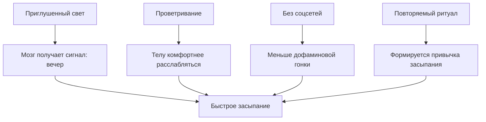

# [Вечерние ритуалы](../../../3.1. healthy lifestyle/Sleep, nutrition, and adolescent energy/articles/evening_rituals_sleep_fast.md): 5 привычек, которые помогут уснуть за 15 минут

Ты ложишься в кровать с надеждой «сейчас быстро усну», а через сорок минут уже успеваешь:
переиграть в голове все неловкие моменты за последние три года, проверить три мессенджера и
решить, что завтра точно начнешь новую [жизнь](../../../1.2_natural_sciences/why_science_help_understand_world/biology.md). Знакомо?  
Хорошая [новость](../../../5.1_technology_and_digital_literacy/information and media literacy/информационная_диета.md): [сон]("./articles/biology_of_night_owls_teens.md") — это не магия и не лотерея. Его можно **настроить**, если перестать
случайно саботировать свой [мозг](../../../3.1. healthy lifestyle/Sleep, nutrition, and adolescent energy/articles/breakfast_for_the_brain.md) по вечерам.

В этой статье соберем **5 вечерних привычек**, которые помогают телу понять: «всё, [режим](../../../5.1_technology_and_digital_literacy/information and media literacy/семейные_правила_потребления_контента.md) боя
окончен, можно выключаться».

> ### 🛑 Рубрика «Миф vs Реальность»
>
> **1. Про “отосплюсь потом”**  
> 🔴 *Миф:* «Если сегодня не усну, завтра досплю».  
> 🟢 *Реальность:* [Сон](../../../3.1. healthy lifestyle/Sleep, nutrition, and adolescent energy/articles/evening_rituals_sleep_fast.md) [нельзя](../../../3.1_healthy_lifestyle/pervaya_pomoshch/ushibi_porezy_ozhogi/07_ushib_chego_nelzya.md) нормально “догнать” по кнопке. Один сбитый вечер часто тянет за собой
> тяжелое утро, сонливость днем и новый поздний отбой.
>
> **2. Про “я просто не сонный”**  
> 🔴 *Миф:* «Если не хочется [спать](../../../how_to_memorize/articles/son.md), значит, организму сейчас не надо».  
> 🟢 *Реальность:* Иногда организму **очень надо**, но он перевозбужден: [свет](../../../1.2_natural_sciences/why_science_help_understand_world/physics.md), переписки, [тревога](../../../how_to_memorize/articles/stress.md),
> громкая [музыка](../../../8.1_entertainment/articles/music.md) и мысли не дают мозгу перейти в [режим сна](../../../3.1. healthy lifestyle/Sleep, nutrition, and adolescent energy/articles/biology_of_night_owls_teens.md).
>
> **3. Про идеальный [ритуал](../../../7.1_art/musical_instruments/articles/gong.md)**  
> 🔴 *Миф:* «Надо делать огромный сложный вечерний уход, иначе не сработает».  
> 🟢 *Реальность:* Работают именно **простые повторяющиеся сигналы**: приглушить свет, проветрить,
> убрать [экран](../../../3.1. healthy lifestyle/Sleep, nutrition, and adolescent energy/articles/gadgets_blue_light_sleep.md), сделать одно спокойное [действие](../../../2.1_society/cause_and_effect_relationships/articles/personal_choice.md).

## Почему вечер — это не “конец дня”, а настройка завтрашней версии тебя

Сон начинается не в тот момент, когда ты лег в кровать. Он начинается за **30–90 минут до этого**.
Именно в это время мозг оценивает обстановку: ярко ли вокруг, шумно ли, безопасно ли, не пора ли
случайно начать думать о всех дедлайнах мира.

Если вечером ты даешь телу понятные сигналы спокойствия, то [засыпание](../../../3.1. healthy lifestyle/Sleep, nutrition, and adolescent energy/articles/evening_rituals_sleep_fast.md) происходит быстрее.
Если даешь хаос, то мозг честно решает: «Похоже, мы не спим. Похоже, мы выживаем».

## Чек-лист: 5 привычек для быстрого засыпания

### 1. Проветри комнату — устрой мозгу “обновление сервера”

Сон в душной комнате — это как пытаться играть на перегретом ноутбуке. Всё вроде работает,
но с жуткими лагами.

Что делать:
- открой окно на 5–10 минут перед сном;
- если холодно — проветри интенсивно и закрой;
- убери ощущение “тяжелого воздуха”.

### 2. Сделай теплый душ или ванну — не кипяток, а режим “расслабить систему”

Теплая [вода](../../../3.1. healthy lifestyle/Sleep, nutrition, and adolescent energy/articles/drinking_regime.md) помогает телу снизить внутреннее [напряжение](../../../how_to_memorize/articles/stress.md).  
Ключевое слово — **теплая**, а не “сварить себя как пельмень”.

Мини-правило:
- 7–10 минут теплой воды достаточно;
- после этого не начинай активничать снова;
- лучше выйти в спокойный свет, а не в яркую комнату и TikTok.

### 3. Убери соцсети и замени их на книгу или спокойное аудио

Да, [лента](../../../5.1_technology_and_digital_literacy/information and media literacy/алгоритмы_и_пузырь_фильтров.md) кажется отдыхом. Но по факту это серия мини-стимулов: мем, новость, чат, [видео](../../../5.1_technology_and_digital_literacy/information and media literacy/оценка_качества_изображений_и_видео.md),
странный комментарий, внезапный кринж. Мозг не отдыхает — он постоянно переключается.

Рабочая замена:
- бумажная книга;
- электронная книга [без яркого свечения]("./articles/gadgets_blue_light_sleep.md");
- спокойная аудиокнига;
- плейлист без “разгона”.

### 4. Собери завтрашний день заранее

Иногда уснуть мешает не [тело](../../../1.2_natural_sciences/why_science_help_understand_world/organism.md), а хаос в голове:  
«а форму я собрал?», «а тетрадь взял?», «а во сколько вставать?»

[Решение](../../../2.1_society/cause_and_effect_relationships/articles/personal_choice.md):
- приготовь одежду;
- сложи рюкзак;
- поставь будильник;
- выпиши 3 дела на завтра.

Когда мозг понимает, что ничего не забыто, он перестает каждые две минуты поднимать тревожную сирену.

### 5. Повторяй один и тот же [порядок](../../../1.2_natural_sciences/why_science_help_understand_world/patterns.md) действий

Ритуал работает потому, что он **повторяется**.  
Мозг любит шаблоны. Если ты несколько дней подряд делаешь одни и те же шаги,
он начинает связывать их со сном.

## Переводчик с подросткового на биологический

**Фраза:** «Я не хочу спать, я просто полежу с телефоном».  
**Перевод:** «Я случайно активировал себе режим бодрствования светом, уведомлениями и микродозами дофамина».

**Фраза:** «Я уставший, но уснуть не могу».  
**Перевод:** «Тело exhausted, а нервная система всё еще онлайн и не получила команду на выключение».

**Фраза:** «Я нормально засыпаю только под видео».  
**Перевод:** «Мой мозг привык к внешнему шуму и теперь боится тишины сильнее, чем контрольной по математике».

## Чит-код для игрока: как уснуть быстрее без героизма

Вот рабочая сборка “антибессонница lite”:

1. За 30 минут до сна — приглуши свет.
2. За 20 минут — убери телефон подальше.
3. За 15 минут — проветри комнату.
4. За 10 минут — душ или умывание теплой водой.
5. Перед сном — книга, аудио или просто тишина.

### Схема: как вечерний ритуал сокращает путь ко сну

## Таблица: что реально помогает, а что только мешает

| Действие | Что кажется | Что происходит на деле |
|:--|:--|:--|
| “Еще 5 минут в ленте” | Я расслабляюсь | Мозг получает новые стимулы и откладывает сон |
| Душная комната | Нормально и так | Телу тяжелее восстановиться |
| Теплый душ | Пустяк | Напряжение снижается, легче замедлиться |
| Собранный рюкзак с вечера | Неважно | Меньше тревожных мыслей перед сном |
| Повторяющийся ритуал | Скучно | Мозг быстрее распознает режим сна |

> [!TIP]
> Не пытайся внедрить все привычки за один вечер. Начни хотя бы с двух:
> **проветривание + без соцсетей за 20 минут до сна**.

### 😂 Анекдот от GPT по теме

— Почему ты не спишь?

— Я настраиваю режим.

— И как успехи?

— Пока режим настраивает меня.

---
**[Автор](../../../5.1_technology_and_digital_literacy/information and media literacy/авторское_право_и_честное_использование.md):** Симкина Дарина  
*[Нейросети](../../../2.1_society/cause_and_effect_relationships/articles/ai_causality.md), использованные при создании статьи: OpenAI GPT-5, ручная редактура*
