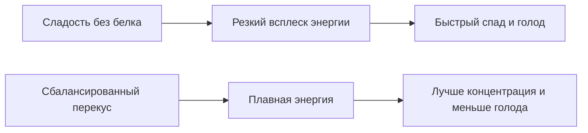

# Здоровый перекус в школе: [идеи](../../../7.2_leisure/useful_and_interesting_leisure/articles/free_leisure_activities.md) ланч-боксов, которые не стыдно взять с собой

Есть два типа школьных перекусов.  
Первый: “что нашлось дома случайно”.  
Второй: тот, после которого ты не умираешь от голода на третьем уроке, не ловишь [сахарный обвал]("./articles/sugar_rollercoaster.md")
и не смотришь с тоской на чужую еду.

Эта статья — про второй вариант. Без скучного “ешьте полезное”, без брокколи в контейнере как
формы наказания. Только **быстрые, нормальные и реально съедобные идеи**, которые можно собрать
за 5–10 минут.

> ### 🛑 Рубрика «Миф vs Реальность»
>
> **1. Про батончик**  
> 🔴 *Миф:* «Если на упаковке написано fitness, значит, это полезно».  
> 🟢 *Реальность:* Иногда это просто сладость в спортивном костюме. Смотри на состав, а не на вайб упаковки.
>
> **2. Про “пустой перекус”**  
> 🔴 *Миф:* «Главное — хоть что-то съесть».  
> 🟢 *Реальность:* Если перекус состоит только из сахара, [энергия](../../../3.1. healthy lifestyle/Sleep, nutrition, and adolescent energy/articles/breakfast_for_the_brain.md) быстро взлетит и так же быстро рухнет.
>
> **3. Про стыдный [ланч-бокс](../../../3.1. healthy lifestyle/Sleep, nutrition, and adolescent energy/articles/healthy_school_snacks.md)**  
> 🔴 *Миф:* «Нормальная [еда](../../../3.1. healthy lifestyle/Sleep, nutrition, and adolescent energy/articles/stress_and_food.md) в школе — это кринж, проще купить чипсы».  
> 🟢 *Реальность:* Кринж — это сидеть голодным и злым к пятому уроку. Удобный ланч-бокс — это не “бабушкина тема”, а нормальный инструмент выживания.

## Формула хорошего перекуса

Чтобы перекус реально работал, в нем желательно собрать хотя бы 2–3 элемента:

- **что-то с белком** — йогурт, сыр, яйцо, орехи, хумус, курица;
- **что-то с нормальными углеводами** — лаваш, цельнозерновой хлеб, банан, овсяное печенье;
- **что-то свежее** — овощи, ягоды, яблоко, виноград;
- [**вода**]("./articles/drinking_regime.md") — потому что половина “я без сил” иногда на самом деле просто обезвоживание.

## 5 идей ланч-боксов, которые выглядят нормально и едятся быстро

### 1. Ролл в лаваше “не развалится, если повезет”

Что положить:
- тонкий лаваш;
- творожный сыр или хумус;
- курицу / индейку / сыр;
- огурец или салат.

Как собрать:
1. Намажь основу.
2. Положи начинку тонким слоем.
3. Сверни плотный ролл.
4. Разрежь пополам.

Плюс: выглядит аккуратно, удобно есть даже на перемене.

### 2. Орехи + фрукт + йогурт

Это вариант, когда времени ноль, а собрать надо что-то [живое](../../../1.2_natural_sciences/why_science_help_understand_world/nature.md).

Комбо:
- горсть орехов;
- яблоко / банан / виноград;
- питьевой йогурт без слишком жесткого сахарного перегруза.

### 3. Мини-бутерброды без уныния

Что работает:
- цельнозерновой хлеб;
- сыр;
- лист салата;
- помидор;
- индейка или яйцо.

Главный секрет — делать маленькие сэндвичи.  
Их удобнее есть, и они выглядят как “нормальный snack”, а не как кирпич.

### 4. Овощные палочки + соус

Да, сейчас прозвучало подозрительно “по-взрослому”, но на деле это удобно.

Что взять:
- морковь;
- огурец;
- сладкий перец;
- небольшой контейнер с хумусом или йогуртовым соусом.

### 5. Сладкий, но не бессмысленный вариант

Если хочется чего-то “вкусного”, а не аскетического:
- банан;
- арахисовая паста;
- овсяное печенье;
- ягоды или сухофрукты в небольшом количестве.

## Быстрые рецепты: 3 варианта за 5 минут

### Рецепт 1. Школьный ролл
- 1 лаваш
- 2 ложки творожного сыра
- 2–3 ломтика индейки
- несколько полосок огурца

Собрал, свернул, готово.

### Рецепт 2. “Контейнер выживания”
- орехи;
- сыр кубиками;
- яблоко кусочками;
- крекеры или хлебцы.

### Рецепт 3. Йогуртовый набор
- густой йогурт;
- банан;
- пара ложек гранолы;
- ягоды.

Если нет времени — просто положи всё отдельно.

## Переводчик с подросткового на биологический

**Фраза:** «Я на уроке туплю, хотя вроде ел утром».  
**Перевод:** «[Завтрак](../../../3.1. healthy lifestyle/Sleep, nutrition, and adolescent energy/articles/breakfast_for_the_brain.md) давно закончился, а [мозг](../../../3.1. healthy lifestyle/Sleep, nutrition, and adolescent energy/articles/breakfast_for_the_brain.md) снова просит топливо, потому что он вообще-то прожорливый [орган](../../../7.1_art/musical_instruments/articles/organ.md)».

**Фраза:** «После сладкого батончика я бодрый, а потом всё».  
**Перевод:** «[Сахар](../../../3.1. healthy lifestyle/Sleep, nutrition, and adolescent energy/articles/sugar_rollercoaster.md) устроил тебе фейерверк, а потом ушел, оставив после себя энергетическую яму».

**Фраза:** «Мне лень носить еду».  
**Перевод:** «Я недооцениваю, насколько сильнее мой мозг работает, когда у него есть стабильная подпитка».

## Чит-код для игрока: перекус, чтобы не тупить на контрольной

Перед важным учебным днем попробуй схему:
- [вода](../../../3.1. healthy lifestyle/Sleep, nutrition, and adolescent energy/articles/drinking_regime.md);
- белок;
- фрукт;
- что-то зерновое.

Пример:
- банан;
- сыр;
- хлебец;
- бутылка воды.

### Схема: что происходит после разного перекуса

## Таблица готовых сочетаний

| Формат | Что положить | Почему это работает |
|:--|:--|:--|
| Быстрый | орехи + яблоко + йогурт | есть белок, клетчатка и нормальный объем |
| Сытный | ролл в лаваше + овощи | удобно, не крошится, держит дольше |
| Легкий | ягоды + сыр + хлебцы | не тяжело, но не пусто |
| “Сладкий” | банан + арахисовая паста + овсяное печенье | вкусно, но без полного сахарного хаоса |

> [!IMPORTANT]
> Перекус — это не замена нормальному обеду. Это **[поддержка](../../../5.1_technology_and_digital_literacy/information and media literacy/кибербуллинг_как_распознать_и_действовать.md) энергии**, чтобы мозг не отключался
> между уроками и делами.

### 😂 Анекдот от GPT по теме

— Что у тебя в ланч-боксе?

— Сбалансированное [питание](../../../3.1. healthy lifestyle/Sleep, nutrition, and adolescent energy/articles/breakfast_for_the_brain.md).

— А почему там один ролл?

— [Баланс](../../../7.2_leisure/useful_and_interesting_leisure/articles/balance_study_rest_hobby.md) держится внутри меня.

---
**[Автор](../../../5.1_technology_and_digital_literacy/information and media literacy/авторское_право_и_честное_использование.md):** Симкина Дарина
*[Нейросети](../../../2.1_society/cause_and_effect_relationships/articles/ai_causality.md), использованные при создании статьи: OpenAI GPT-5, ручная редактура*
