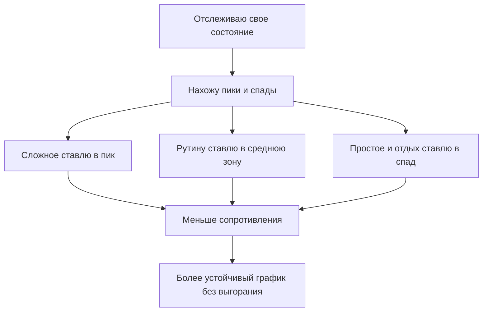

# Как построить свой идеальный график: искусство управления энергией, а не временем

Многие пытаются жить по формуле: “сейчас я просто составлю идеальное расписание — и стану машиной”.
Потом наступает реальность: в 8:00 ты один [человек](../../../1.2_natural_sciences/why_science_help_understand_world/life_sciences.md), в 14:30 — другой, а в 22:10 вообще существо,
которое способно только открыть холодильник и смотреть внутрь как философ.

Проблема не в [том](../../../7.1_art/musical_instruments/articles/drums.md), что ты “недисциплинированный”.  
Проблема в том, что люди — не роботы с одинаковым зарядом батареи весь день.

Поэтому идеальный график — это не когда каждая минута расписана.  
Это когда ты понимаешь, **в какие часы у тебя [мозг](../../../3.1. healthy lifestyle/Sleep, nutrition, and adolescent energy/articles/breakfast_for_the_brain.md) реально тянет сложное**, а в какие — лучше
оставить что-то попроще.

> ### 🛑 Рубрика «Миф vs Реальность»
>
> **1. Про [продуктивность](../../../3.1. healthy lifestyle/Sleep, nutrition, and adolescent energy/articles/ideal_schedule_energy_management.md)**  
> 🔴 *Миф:* «Надо всегда работать одинаково стабильно с утра до ночи».  
> 🟢 *Реальность:* [Энергия](../../../3.1. healthy lifestyle/Sleep, nutrition, and adolescent energy/articles/breakfast_for_the_brain.md) в течение дня меняется волнами. И это нормально.
>
> **2. Про дисциплину**  
> 🔴 *Миф:* «Если я не могу учиться 6 часов подряд — я ленивый».  
> 🟢 *Реальность:* Скорее всего, ты просто игнорируешь естественные пики и спады концентрации.
>
> **3. Про идеальный [тайм-менеджмент](../../../3.1. healthy lifestyle/Sleep, nutrition, and adolescent energy/articles/ideal_schedule_energy_management.md)**  
> 🔴 *Миф:* «Нужно лучше управлять временем».  
> 🟢 *Реальность:* Время у всех одинаковое. Разница чаще в том, **на каком уровне энергии** ты пытаешься делать задачу.

## Почему не работает график “как у успешных людей из интернета”

Ты можешь скопировать чей угодно план:
- подъем в 5:00;
- холодный душ;
- 4 часа глубокой работы;
- [пробежка]("./articles/sport_and_energy.md");
- медитация;
- [изучение](../../../1.2_natural_sciences/why_science_help_understand_world/science.md) китайского до завтрака.

Но если твой [организм](../../../1.2_natural_sciences/why_science_help_understand_world/organism.md) в это время хочет только жить спокойно и не развалиться, график долго не протянет.

Главный вопрос не “какой график модный?”, а **“когда я соображаю лучше всего?”**

## Три зоны дня: когда делать что

### 1. Пик энергии
Это время, когда ты:
- быстрее соображаешь;
- меньше отвлекаешься;
- можешь решать сложные [задачи](../../../1.2_natural_sciences/why_science_help_understand_world/research_work.md).

Сюда лучше ставить:
- математику;
- программирование;
- подготовку к контрольной;
- написание чего-то важного.

### 2. Средняя энергия
Голова уже не суперострая, но ты еще в строю.

Сюда подходит:
- домашка средней сложности;
- [чтение](../../../7.2_leisure/useful_and_interesting_leisure/articles/reading_and_self_education.md);
- [повторение материала](../../../how_to_memorize/articles/povtorenie.md);
- организационные дела.

### 3. Спад энергии
Это время, когда пытаться “героически учиться” — сомнительная инвестиция.

Сюда лучше:
- собрать рюкзак;
- разобрать стол;
- сделать легкие задания;
- принять душ;
- пойти [спать](../../../how_to_memorize/articles/son.md), а не изображать подвиг.

## Как найти свой [ритм](../../../7.1_art/musical_instruments/articles/castanets.md) за 3 дня

Попробуй мини-наблюдение.

### День 1–3:
Каждые 2–3 часа записывай:
- насколько ты бодрый по шкале от 1 до 10;
- насколько хорошо думаешь;
- хочется ли тебе общаться или, наоборот, тишины;
- легко ли начать задачу.

Через 3 дня у тебя появится черновая [карта](../../../5.1_technology_and_digital_literacy/information and media literacy/карта_компетенций_по_возрастам.md):
- когда ты “тащишь”;
- когда работаешь нормально;
- когда уже пора не насиловать мозг.

## Переводчик с подросткового на биологический

**Фраза:** «Я днем туплю, а ночью внезапно оживаю».  
**Перевод:** «Мой ритм бодрствования, привычки и нагрузка сдвинуты так, что вечером нервная система активнее, чем утром».

**Фраза:** «Я весь день ничего не делал, а [устал](../../../how_to_memorize/articles/ustalost.md)».  
**Перевод:** «Энергия тратится не только на [действия](../../../3.1_healthy_lifestyle/pervaya_pomoshch/ushibi_porezy_ozhogi/03_obschie_pravila_algorithm.md), но и на [стресс](../../../3.1. healthy lifestyle/Sleep, nutrition, and adolescent energy/articles/chronic_sleep_deprivation.md), переключения и попытки заставить себя делать не то и не тогда».

**Фраза:** «У меня плохой график, потому что я слабый».  
**Перевод:** «Я пока не отследил собственные пики энергии и пытаюсь жить по чужому шаблону».

## Чит-код для игрока: как распределять нагрузку без насилия над собой

Попробуй такую систему:

1. **Сложные задачи** — в пик энергии.
2. **Рутину** — в среднюю зону.
3. **Мелочи и сборы** — в спад.
4. **Не забивай каждую минуту** — оставляй [воздух](../../../1.2_natural_sciences/why_science_help_understand_world/environmental_sciences.md) между делами.
5. **Планируй не “время”, а “заряд”**.

### Пример живого графика

| [Уровень](../../../8.1_entertainment/articles/gamification.md) энергии | Что делать |
|:--|:--|
| Высокий | сложная [учеба](../../../3.1. healthy lifestyle/Sleep, nutrition, and adolescent energy/articles/breakfast_for_the_brain.md), задачи на логику, контрольные темы |
| Средний | чтение, конспекты, [практика](../../../1.2_natural_sciences/why_science_help_understand_world/experimental_science.md), домашка попроще |
| [Низкий](../../../7.1_art/musical_instruments/articles/bassoon.md) | организация, прогулка, душ, [отдых](../../../3.1. healthy lifestyle/Sleep, nutrition, and adolescent energy/articles/evening_rituals_sleep_fast.md), [сон](../../../3.1. healthy lifestyle/Sleep, nutrition, and adolescent energy/articles/evening_rituals_sleep_fast.md) |

### Схема: как выглядит нормальное управление энергией

## Мини-чек-лист идеального графика

- я знаю, когда у меня пик [внимания](../../../how_to_memorize/articles/vnimanie.md);
- не ставлю самое тяжелое на момент, когда уже разваливаюсь;
- оставляю время на еду, воду и паузы;
- не сравниваю свой [режим](../../../5.1_technology_and_digital_literacy/information and media literacy/семейные_правила_потребления_контента.md) с чужими рилсами;
- корректирую план, если день пошел не по сценарию.

> [!NOTE]
> Идеальный график не высечен в камне. Он меняется вместе с нагрузкой, сезоном, сном и даже настроением.
> Нормально пересобирать его заново.

## Финальная мысль

Настоящая продуктивность — это не когда ты выжимаешь из себя максимум каждый час.  
Это когда ты умеешь [замечать](../../../how_to_memorize/articles/vnimanie.md): “сейчас мой мозг тянет сложное”, “сейчас лучше сделать простое”,
“а сейчас мне вообще-то нужен [сон]("./articles/sleep_and_memory_grades.md"), а не подвиг”.

И вот это уже не слабость.  
Это умение **не воевать с собой**, а работать вместе со своим организмом.

### 😂 Анекдот от GPT по теме

— Я составил идеальный график!

— И как?

— По графику я уже успешен. Осталось только, чтобы [тело](../../../1.2_natural_sciences/why_science_help_understand_world/organism.md) об этом узнало.

---
**[Автор](../../../5.1_technology_and_digital_literacy/information and media literacy/авторское_право_и_честное_использование.md):** Симкина Дарина  
*[Нейросети](../../../2.1_society/cause_and_effect_relationships/articles/ai_causality.md), использованные при создании статьи: OpenAI GPT-5, ручная редактура*
