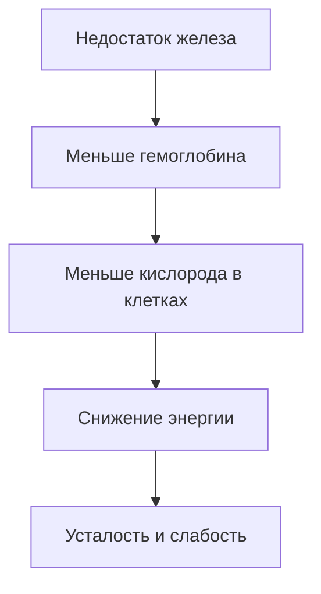
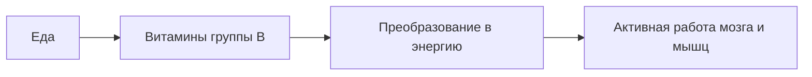

# [Микронутриенты](../../../3.1. healthy lifestyle/Sleep, nutrition, and adolescent energy/articles/micronutrients_and_teenagers.md) для подростков: железо, магний и [витамины](../../../3.1. healthy lifestyle/Sleep, nutrition, and adolescent energy/articles/micronutrients_and_teenagers.md) группы B

Ты когда-нибудь ловил себя на мысли:  
«Я вроде [спал нормально]("./articles/sleep_and_memory_grades.md"), но всё равно чувствую себя разбитым»?

Иногда дело не в режиме сна, школе или нагрузке. [Причина](../../../2.1_society/cause_and_effect_relationships/articles/causality_base.md) может быть гораздо менее очевидной — **дефицит микронутриентов**.

Микронутриенты — это витамины и [минералы](../../../3.1. healthy lifestyle/Sleep, nutrition, and adolescent energy/articles/micronutrients_and_teenagers.md), которые нужны организму в небольших количествах, но без них многие процессы просто перестают нормально работать.  

Особенно важны для подростков **железо, магний и витамины группы B**. Их нехватка может вызывать [усталость](../../../3.1. healthy lifestyle/Sleep, nutrition, and adolescent energy/articles/sugar_rollercoaster.md), проблемы с концентрацией и даже перепады настроения.

Разберёмся, почему именно эти вещества играют такую большую роль.

>### 🛑 Рубрика «Миф vs Реальность»
>
>**1. Про усталость**  
>🔴 *Миф:* «Если я постоянно устаю — значит просто ленюсь».  
>🟢 *Реальность:* Усталость часто связана с **дефицитом витаминов и минералов**.
>
>**2. Про [питание](../../../3.1. healthy lifestyle/Sleep, nutrition, and adolescent energy/articles/breakfast_for_the_brain.md)**  
>🔴 *Миф:* «Если я ем много, значит получаю всё необходимое».  
>🟢 *Реальность:* Важно **не количество еды, а её состав**.

## Железо: кислород для твоего организма

Железо — один из самых важных минералов для организма. Оно участвует в создании **гемоглобина** — белка в красных кровяных клетках.

Гемоглобин переносит **кислород** от лёгких ко всем клеткам тела.

Если железа не хватает, клетки начинают получать меньше кислорода. Это состояние называется **анемия**.

### [Симптомы](../../../4.2/critical_thinking/articles/problem_structuring.md) нехватки железа

- постоянная усталость  
- бледность кожи  
- головокружение  
- трудности с концентрацией  

[Подростки](../../../3.1. healthy lifestyle/Sleep, nutrition, and adolescent energy/articles/biology_of_night_owls_teens.md) особенно подвержены дефициту железа, потому что [организм](../../../1.2_natural_sciences/why_science_help_understand_world/organism.md) в этот период **быстро растёт и требует больше ресурсов**.

## Магний: антистресс для нервной системы

Магний участвует более чем в **300 биохимических реакциях организма**.

Он помогает:

- нервной системе работать стабильно  
- мышцам расслабляться  
- регулировать [уровень](../../../8.1_entertainment/articles/gamification.md) стресса  

Когда магния не хватает, нервная система начинает работать **в режиме постоянного напряжения**.

Это может проявляться так:

- раздражительность  
- тревожность  
- проблемы со сном  
- мышечные подёргивания  

Магний часто называют **«минералом спокойствия»**.

## Витамины группы B: топливо для мозга

Витамины группы B — это целая команда веществ, которые помогают организму превращать пищу в энергию.

Особенно важны:

- **B6** — участвует в работе нервной системы  
- **B9 (фолиевая [кислота](../../../1.1_structure_of_the_world/matter/articles/12_chemical_properties.md))** — важен для роста клеток  
- **B12** — участвует в образовании крови  

Если витаминов группы B не хватает, организм хуже производит энергию из пищи.

Поэтому при дефиците могут появляться:

- быстрая утомляемость  
- снижение концентрации  
- проблемы с [памятью](../../../how_to_memorize/articles/pamyat.md)  

## Почему подростки часто сталкиваются с дефицитом?

В подростковом возрасте организм находится в фазе **быстрого роста и гормональной перестройки**.

Это значит, что потребность в витаминах и минералах увеличивается.

Но одновременно появляются факторы, которые мешают получать их достаточно:

- нерегулярное питание  
- фастфуд  
- [пропуск завтрака]("./articles/breakfast_for_the_brain.md")  
- высокий уровень стресса  

В итоге организм начинает работать **на грани своих ресурсов**.

## Что делать? (Короткий чек-лист)

Поддерживать уровень микронутриентов проще, чем кажется.

* **Ешь разнообразно.** В рационе должны быть мясо, рыба, овощи, крупы и орехи.
* **Не пропускай [завтрак](../../../3.1. healthy lifestyle/Sleep, nutrition, and adolescent energy/articles/breakfast_for_the_brain.md).** Утренний приём пищи помогает запустить [обмен веществ](../../../3.1. healthy lifestyle/Sleep, nutrition, and adolescent energy/articles/drinking_regime.md).
* **Следи за уровнем железа.** Особенно если часто чувствуешь слабость.
* **Старайся меньше заменять нормальную еду фастфудом.**

Иногда простое изменение питания может **значительно повысить уровень энергии**.

### 😂 Анекдот от GPT по теме

— Почему ты такой уставший?  

— Организм говорит, что ему не хватает железа.  

— Так съешь шпатель.

— Кажется, [врач](../../../3.1_healthy_lifestyle/pervaya_pomoshch/ushibi_porezy_ozhogi/06_ushib_kogda_vrach.md) имел в виду немного другое железо…

---

**[Автор](../../../5.1_technology_and_digital_literacy/information and media literacy/авторское_право_и_честное_использование.md):** Титова Дарья 

**Нейронные сети, использованные при создании статьи:** OpenAI GPT-4o