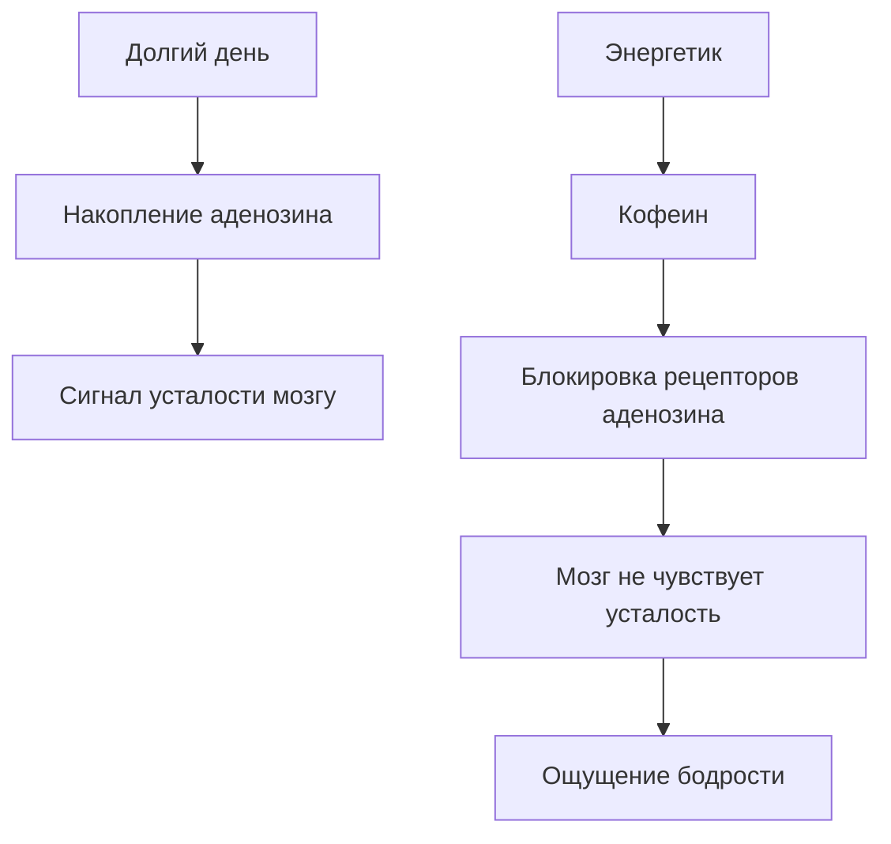
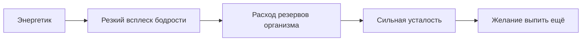

# Ловушка энергетиков: почему [кофеин](../../../3.1. healthy lifestyle/Sleep, nutrition, and adolescent energy/articles/the_energy_trap.md) и таурин опасны для растущего организма

Ты стоишь перед холодильником в магазине. Яркие банки с молниями, тиграми и словами **Energy**, **Power**, **Boost** обещают одно: выпьешь — и сразу появятся силы. Можно не [спать](../../../how_to_memorize/articles/son.md) всю ночь, готовиться к экзамену или играть до утра.

Но есть один нюанс. [Энергетики](../../../3.1. healthy lifestyle/Sleep, nutrition, and adolescent energy/articles/the_energy_trap.md) не создают энергию. Они **заставляют [организм](../../../1.2_natural_sciences/why_science_help_understand_world/organism.md) тратить резервы быстрее**, чем он успевает восстановиться.

Разберёмся, что происходит внутри организма после банки энергетика и почему для подростков это особенно опасно.

>### 🛑 Рубрика «Миф vs Реальность»
>
>**1. Про энергию**  
>🔴 *Миф:* «Энергетик даёт настоящую энергию».  
>🟢 *Реальность:* Он не создаёт энергию, а **блокирует сигнал усталости**, из-за чего [мозг](../../../3.1. healthy lifestyle/Sleep, nutrition, and adolescent energy/articles/breakfast_for_the_brain.md) думает, что всё в порядке.
>
>**2. Про [безопасность](../../../2.1_society/cause_and_effect_relationships/articles/trust_predictability.md)**  
>🔴 *Миф:* «Если напиток продаётся в магазине — значит он безопасен».  
>🟢 *Реальность:* Во многих странах энергетики **ограничивают для подростков**, потому что их нервная система ещё развивается.

## Что происходит в мозге после энергетика?

В течение дня в мозге накапливается [вещество](../../../1.1_structure_of_the_world/matter/articles/01_matter.md) **аденозин**. Оно работает как биологический индикатор усталости.

Когда аденозина становится много, мозг получает сигнал:

> «Ты [устал](../../../how_to_memorize/articles/ustalost.md). Пора отдыхать».

Но кофеин действует как **блокировщик этих сигналов**. Он занимает те же рецепторы, что и аденозин, и мозг перестаёт чувствовать [усталость](../../../3.1. healthy lifestyle/Sleep, nutrition, and adolescent energy/articles/sugar_rollercoaster.md).

Проблема в [том](../../../7.1_art/musical_instruments/articles/drums.md), что **усталость никуда не исчезает**. Организм всё ещё истощён, но мозг временно перестаёт это [замечать](../../../how_to_memorize/articles/vnimanie.md).

## Таурин: загадочный сосед кофеина

Помимо кофеина, в энергетиках часто содержится **таурин** — аминокислота, участвующая в работе:

- мозга  
- сердца  
- нервной системы  

В небольших количествах таурин естественно присутствует в организме. Но в энергетиках его [концентрация](../../../how_to_memorize/articles/koncentraciya.md) значительно выше, особенно в сочетании с кофеином.

Когда кофеин стимулирует нервную систему, таурин может усиливать воздействие на:

- сердечный [ритм](../../../7.1_art/musical_instruments/articles/castanets.md)  
- передачу нервных импульсов  
- [уровень](../../../8.1_entertainment/articles/gamification.md) возбуждения мозга  

В результате организм получает **двойную стимуляцию**.

## Почему [подростки](../../../3.1. healthy lifestyle/Sleep, nutrition, and adolescent energy/articles/biology_of_night_owls_teens.md) особенно уязвимы?

[Тело](../../../1.2_natural_sciences/why_science_help_understand_world/organism.md) подростка — это организм, который активно развивается. Формируются:

- мозг  
- гормональная система  
- сердечно-сосудистая система  

Сильные стимуляторы могут вмешиваться в эти процессы.

### 1. Нарушение сна

Кофеин может оставаться в организме **до 6–8 часов**.

Если выпить энергетик вечером, мозг получает сигнал:

> «Сейчас ещё день».

Это мешает выработке гормона сна **мелатонина**, который отвечает за [засыпание](../../../3.1. healthy lifestyle/Sleep, nutrition, and adolescent energy/articles/evening_rituals_sleep_fast.md).

### 2. [Перегрузка](../../../5.1_technology_and_digital_literacy/information and media literacy/информационная_диета.md) нервной системы

Подростковая [нервная система]("./articles/stress_and_food.md") более чувствительна к стимуляторам.

Поэтому возможны:

- тревожность  
- раздражительность  
- дрожь  
- трудности с концентрацией  

Парадоксально, но энергетик, выпитый «для учёбы», иногда **ухудшает [внимание](../../../5.1_technology_and_digital_literacy/information and media literacy/эмоциональные_триггеры_в_контенте.md)**.

### 3. Нагрузка на [сердце](../../../3.1. healthy lifestyle/Sleep, nutrition, and adolescent energy/articles/the_energy_trap.md)

Кофеин увеличивает:

- частоту сердцебиения  
- артериальное [давление](../../../1.1_structure_of_the_world/matter/articles/07_gases.md)  

Если пить энергетики регулярно, сердце начинает работать **в режиме постоянного стресса**.

Это явление называют **«энергетическим откатом»** — после краткого подъёма энергии наступает сильная усталость.

## Что делать вместо энергетиков? (Короткий чек-лист)

Мы не можем полностью отменить усталость, но можем перестать вредить организму.

* **[Сон](../../../3.1. healthy lifestyle/Sleep, nutrition, and adolescent energy/articles/evening_rituals_sleep_fast.md) — главный [источник](../../../5.1_technology_and_digital_literacy/information and media literacy/дезинформация_и_фейки.md) энергии.** Большинству подростков нужно 8–10 часов сна.
* **[Пей воду]("./articles/drinking_regime.md").** Даже лёгкое обезвоживание снижает концентрацию.
* **Делай перерывы.** Мозгу нужен [отдых](../../../3.1. healthy lifestyle/Sleep, nutrition, and adolescent energy/articles/evening_rituals_sleep_fast.md) каждые 40–60 минут.
* **[Двигайся.]("./articles/sport_and_energy.md")** Короткая прогулка или лёгкая [физическая активность](../../../3.1. healthy lifestyle/Sleep, nutrition, and adolescent energy/articles/sport_and_energy.md) может бодрить лучше кофеина.

### 😂 Анекдот от GPT по теме

Разговаривают два студента:

— Я выпил энергетик, чтобы не спать всю ночь.

— И помогло?

— Да… теперь не сплю я, мой мозг и моё сердце.

---

**[Автор](../../../5.1_technology_and_digital_literacy/information and media literacy/авторское_право_и_честное_использование.md):** Титова Дарья

**Нейронные сети, использованные при создании статьи:** OpenAI GPT-4o