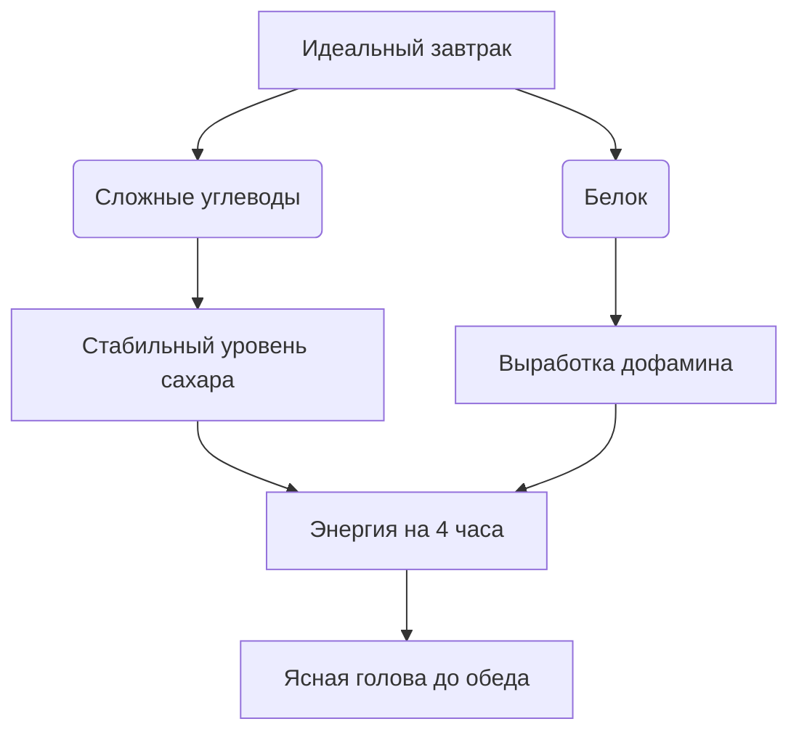
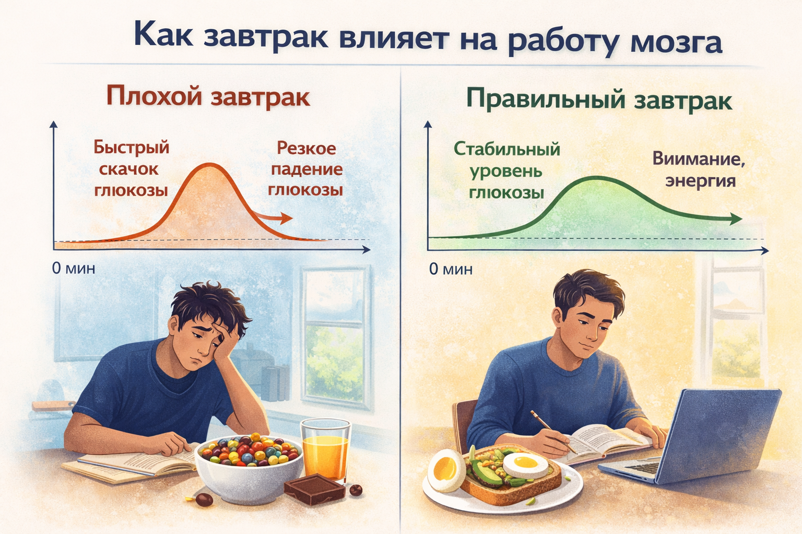

# Завтрак для мозга: Что съесть утром, чтобы «дожить» до обеда

Утро. Будильник прозвенел три раза. Ты кое-как дополз до кухни. В холодильнике глаз цепляется за вчерашнюю пиццу или коробку с самыми быстрыми сладкими хлопьями. «Сойдет, главное — быстро».

Спойлер: это не «сойдет». То, что ты съешь в первые два часа после пробуждения, определит, будешь ты на третьем уроке соображать или тупо смотреть в окно, мечтая снова оказаться в подушке.

> ### 🛑 Рубрика «Миф vs Реальность»
>
> **1. Про хлопья и соки**  
> 🔴 *Миф:* «Хлопья с молоком и стакан апельсинового сока — это полезно».  
> 🟢 *Реальность:* Это сахарная бомба. Через 40 минут уровень глюкозы рухнет, и ты снова захочешь есть, а мозг начнет тормозить.
>
> **2. Про то, что можно не есть**  
> 🔴 *Миф:* «Я все равно не хочу есть утром, пропущу завтрак».  
> 🟢 *Реальность:* Если ты не ешь с 20:00 до 13:00 следующего дня — твой мозг работает в режиме энергосбережения. Ты просто не можешь соображать на полную.

## Разбор идеального завтрака: Белки + Сложные углеводы

Представь, что твой мозг — это суперкар. Ему нужно два вида топлива: быстрое (чтобы завестись) и медленное (чтобы ехать).

*   **Сложные углеводы (каши, цельнозерновой хлеб).** Они расщепляются постепенно, подкидывая глюкозу в кровь маленькими порциями. Мозг получает стабильное питание 3–4 часа.
*   **Белки (яйца, творог, сыр, йогурт).** Они дают аминокислоту **тирозин**, из которой мозг делает **дофамин** и **норадреналин**. Эти вещества отвечают за концентрацию и бодрость.

# Сладкие хлопья: Враг под видом друга

**Быстрые завтраки** (кукурузные хлопья, шоколадные шарики, сладкие подушки) — это чистый сахар и быстрые углеводы. Они взлетают в кровь мгновенно. Ты чувствуешь прилив сил... на 30–40 минут.

Поджелудочная железа в ужасе от такого наплыва сахара и выбрасывает **тонну инсулина**, чтобы быстро это убрать. Инсулин убирает сахар так эффективно, что через час его становится **меньше, чем было до завтрака**.

**Результат:** вялость, трясущиеся руки, раздражительность и дикое желание съесть еще одну шоколадку. Это называется **«реактивная гипогликемия»**.

## Чек-лист: Топ-3 завтрака для подростка

- **Вариант 1 (Классика):** Овсянка (не моменталка, а обычная) + яйцо пашот или кусок сыра + ложка арахисовой пасты без сахара.
- **Вариант 2 (Для тех, кто не любит каши):** Тост из цельнозернового хлеба с авокадо и яичницей. Или с творожным сыром и слабосоленой рыбой.
- **Вариант 3 (Сладкоежкам):** Натуральный йогурт (без добавок) с горстью ягод, орехами и ложкой меда. Блинчики из цельнозерновой муки с творогом внутри.

## 😂 Анекдот от GPT по теме

Звонок на первом уроке.   
Учительница:  
— Дети, откройте тетради, запишите сегодняшнее число.  

Голос с последней парты:  
— МарьИванна, мой мозг еще не загрузился. У него «синий экран смерти». Я только кофе выпил, а он требует драники.

---
**Автор:** Ткаченко Елизавета  
**Нейронные сети, использованные при создании статьи:** OpenAI GPT-4o, Google Gemini 1.5 Pro
