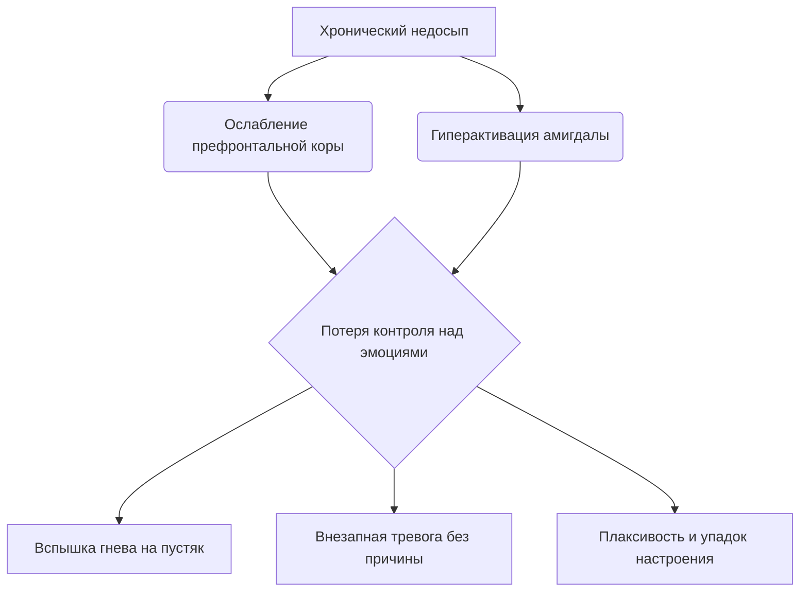
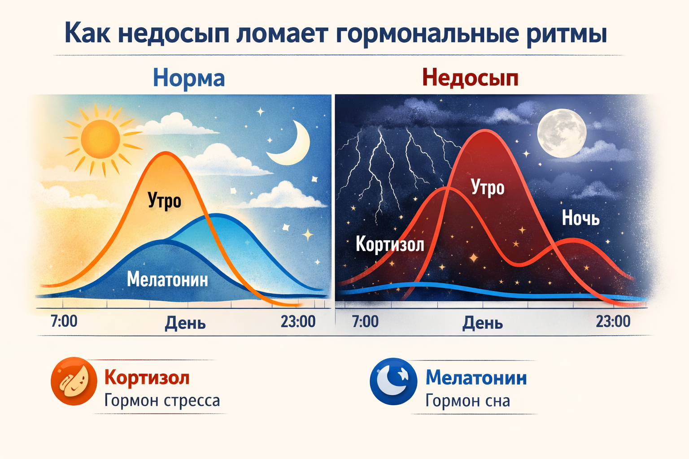

# Хронический недосып: Скрытые последствия для психики

Кажется, что пропустить пару часов сна — не проблема. «Отосплюсь в выходные» — говоришь ты, листая ленту в 2 часа ночи. Но организм так не работает. Он ведет учет, и этот учет называется **хронической депривацией сна**.

Если ты систематически спишь меньше 7–8 часов, твой мозг начинает работать в аварийном режиме. И дело не только в темных кругах под глазами. Речь идет о том, как ты чувствуешь себя эмоционально: твоя тревожность, раздражительность и внезапная грусть имеют прямую связь с кроватью.

> ### 🛑 Рубрика «Миф vs Реальность»
>
> **1. Про привыкание**  
> 🔴 *Миф:* «Мой организм привык спать по 5 часов, мне хватает».  
> 🟢 *Реальность:* Твой организм привык *выживать* на 5 часах сна. Твоя продуктивность и настроение всё равно ниже твоего же реального потенциала.
>
> **2. Про эмоции**  
> 🔴 *Миф:* «Я злюсь, потому что день не задался».  
> 🟢 *Реальность:* Скорее всего, ты злишься, потому что не выспался. Недосып делает негативные эмоции в 2 раза интенсивнее.

## Почему без сна всё бесит?

В твоем мозге есть две важные структуры: **миндалевидное тело** (центр страха и тревоги) и **префронтальная кора** (центр логики и самоконтроля). Когда ты высыпаешься, префронтальная кора успешно тормозит миндалину, не давая панике разгораться.

Когда ты не спишь, префронтальная кора «отключается» быстрее остальных отделов. А миндалевидное тело, наоборот, переходит в режим гиперчувствительности.

# Химия усталости: Кортизол vs Мелатонин

Когда ты не спишь, тело думает, что наступила катастрофа (ведь ночью наши предки не бодрствовали просто так — только если была угроза). В кровь выбрасывается гормон стресса — **кортизол**.

В норме кортизол высок с утра (чтобы проснуться) и низкий ночью (чтобы уснуть). При недосыпе он остается высоким и ночью. Это создает эффект «загнанного зверя»: ты уставший, но при этом напряженный и дерганый. Ты хочешь отдохнуть, но твое тело находится в состоянии войны.

## Чек-лист: Твоя психика под ударом (красные флаги)

Если ты мало спишь и замечаешь у себя эти симптомы, дело не в «сложном возрасте», а в банальной нехватке сна.

- **Катастрофизация.** Ты получил(а) тройку? «Всё, моя жизнь кончена, я нищий неудачник». Мозг недосыпающего не видит полутонов.
- **Социальная тревога.** Тебе кажется, что все на тебя смотрят и обсуждают. На самом деле, это просто уставший мозг ищет опасность там, где ее нет.
- **Эмоциональные качели.** Смех сменяется слезами за 5 минут. Твой эмоциональный тормоз не работает.

## 😂 Анекдот от GPT по теме

Встречаются два нейрона в голове у подростка.  
— Слышал, хозяин опять спать ложится в 3 утра.  
— Да, готовься, завтра с утра устроим ему паническую атаку из-за сообщения в чате. Пусть знает, что с нами так нельзя!

---
**Автор:** Ткаченко Елизавета  
**Нейронные сети, использованные при создании статьи:** OpenAI GPT-4o, Google Gemini 1.5 Pro
