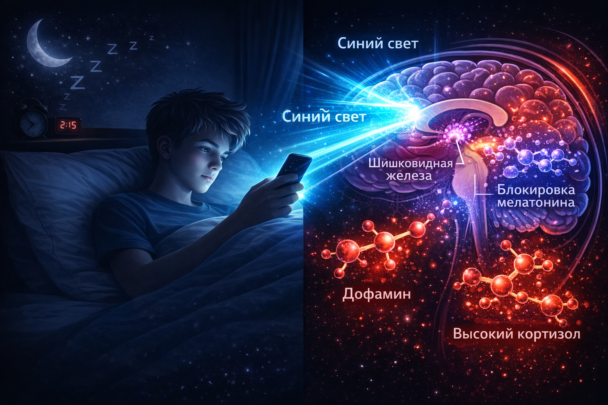
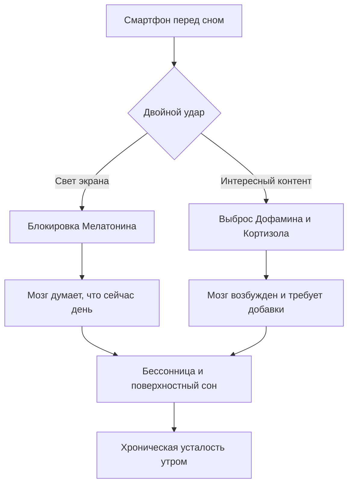

# Гаджеты перед сном: Как синий свет «крадет» мелатонин и энергию

Ты заходишь в соцсети «буквально на пять минут» перед сном, а через час ловишь себя на просмотре видео о том, как строят бассейны в джунглях. Знакомо? Но проблема не только в потраченном времени. Твой смартфон — это мощный световой прибор и нейрохимическая ловушка, которая буквально «взламывает» твой мозг.

Разберемся, почему экран телефона — худший враг твоей бодрости, как связаны лайки и бессонница, и как перестать чувствовать себя разбитым по утрам.

> ### 🛑 Рубрика «Миф vs Реальность»
>
> **1. Про ночной режим**  
> 🔴 *Миф:* «Я включил "Night Shift" (желтый экран), теперь телефон вообще не портит сон».  
> 🟢 *Реальность:* Желтый фильтр снижает нагрузку на глаза, но **яркость** экрана всё равно подавляет мелатонин. К тому же, сам контент (игры, чаты) держит мозг в напряжении.
>
> **2. Про расслабление через ленту**  
> 🔴 *Миф:* «Листание мемов помогает мне отвлечься и быстрее уснуть».  
> 🟢 *Реальность:* Это иллюзия. Каждое новое видео дает мозгу микродозу **дофамина**. Мозг переходит в режим ожидания «что там дальше?», и сон уходит на второй план.
>
> **3. Про телевизор**  
> 🔴 *Миф:* «Телевизор далеко, он не светит прямо в глаза, значит, он безопасен».  
> 🟢 *Реальность:* Любой яркий источник света в темной комнате замедляет выработку гормона сна, просто телефон делает это агрессивнее из-за близости к лицу.

## Враг №1: Синий свет (Световая диверсия)

Наши предки миллионы лет засыпали в полной темноте. Мозг привык: если света нет — пора спать.

Экраны смартфонов излучают свет в **синем спектре** (Blue Light). Для твоего организма этот свет — точная копия полуденного солнца. В глазах есть специальные фоторецепторы, которые напрямую связаны с твоими биологическими часами. Когда на них попадает синий свет, они блокируют шишковидную железу.

**Результат:** Выработка **мелатонина** (гормона, который командует «спать!») останавливается. Твое тело думает, что сейчас 12:00 дня, даже если на часах полночь.

## Враг №2: Контент (Дофаминовая петля)

Свет — это полбеды. Вторая проблема — то, *что* ты смотришь.

1.  **Думскроллинг (Doomscrolling):** Бесконечная лента новостей или ТикТока создана так, чтобы ты не мог остановиться. Это «дофаминовая игла». Мозг боится пропустить что-то интересное и блокирует чувство усталости.
2.  **Кортизол (Стресс):** Проиграл катку в игре? Прочитал плохую новость? Получил странное сообщение? В кровь выбрасывается кортизол. Это гормон стресса. Он переводит организм в режим «Бей или беги». Уснуть в таком состоянии физически невозможно.

### Как это выглядит внутри тебя (Схема)

## Как провести «цифровой детокс» и не сойти с ума?

Никто не заберет у тебя телефон навсегда, но можно минимизировать ущерб:

*   **Правило 60 минут:** Постарайся отложить гаджет за час до сна. Если это невозможно — хотя бы за 20 минут.
*   **Яркость на минимум:** Если всё же пришлось взять телефон, убавь яркость так низко, как только возможно.
*   **Замени ленту на аудио:** Подкасты или аудиокниги — отличный выход. Информация поступает, но глаза отдыхают в темноте, и мелатонин вырабатывается штатно.
*   **Купи обычный будильник:** Если телефон лежит под подушкой, велик соблазн проверить его «последний раз». Оставь его на зарядке в другом конце комнаты.

### 😂 Анекдот от GPT по теме

— Доктор, я постоянно чувствую себя уставшим, у меня болят глаза и я засыпаю только под утро...

— Понятно. Давайте попробуем цифровой детокс.

— Ого! А это приложение можно скачать в App Store или в Google Play?

---
**Автор:** Мельцова Вероника  
*Нейронные сети, использованные при создании статьи: OpenAI GPT-4o, Google Gemini 2.5 Pro*

