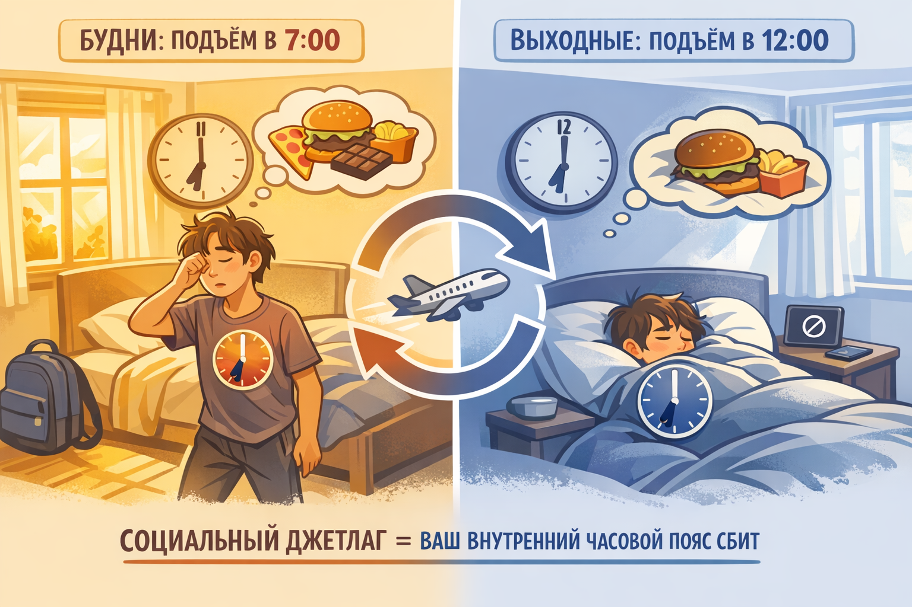

# Режим дня в выходные: Стоит ли «отсыпаться» за всю неделю?

Наконец-то пятница вечером! Впереди два дня свободы. Ты с чистой совестью зависаешь с друзьями или залипаешь в сериал до трёх ночи, потому что завтра можно не вставать. А в субботу утром счастливо дрыхнешь до обеда. В воскресенье — та же история. Идеальный уикенд, правда?

Но тогда почему в понедельник утром ты чувствуешь себя так, будто вообще не ложился? Будто по тебе проехался грузовик, а потом сдал назад? Голова тяжёлая, глаза слипаются, а первая мысль: «Ненавижу эту жизнь и школу».

Знакомо? Поздравляю, ты столкнулся с **социальным джетлагом**. И это не шутка учёных, а реальная проблема миллионов подростков (и взрослых тоже).

> ### 🛑 Рубрика «Миф vs Реальность»
>
> **1. Про долг сна**
> 🔴 *Миф:* «Сон можно накопить, как деньги на карте. В будни я сплю мало, значит, в выходные отосплюсь за всю неделю».
> 🟢 *Реальность:* У сна нет «банковского счёта». Недосып нельзя возместить одним долгим сном. Более того, резкие перепады режима вреднее, чем стабильный недосып.
>
> **2. Про отдых**
> 🔴 *Миф:* «Валяться в кровати до обеда — значит хорошо отдохнуть».
> 🟢 *Реальность:* Если спать больше 10 часов, фазы сна сбиваются, и ты просыпаешься **более разбитым**, чем если бы встал в 9 утра.
>
> **3. Про выходной режим**
> 🔴 *Миф:* «Выходные для того и нужны, чтобы расслабиться и забыть про расписание».
> 🟢 *Реальность:* Твои внутренние часы не знают, что такое «выходной». Они работают 24/7 и требуют стабильности.

---

## Социальный джетлаг: что это за зверь?

Ты когда-нибудь летал на самолёте в другой часовой пояс и чувствовал себя разбитым несколько дней? Это **джетлаг** — рассогласование между внутренними часами организма и реальным временем суток.

**Социальный джетлаг** — это то же самое, только без перелёта. Ты просто сдвигаешь свой режим в выходные так сильно, что организм думает, будто ты улетел в другую страну.

Вот как это выглядит:

- **В будни:** ты ложишься в 23:00, встаёшь в 7:00 (условно)
- **В пятницу:** ложишься в 2:00 ночи
- **В субботу:** встаёшь в 12:00 (или позже)
- **В воскресенье:** опять ложишься в 2:00, встаёшь в 12:00
- **В понедельник:** нужно встать в 7:00, но организм думает, что сейчас 4:00 утра по его времени

**Результат:** ты как будто слетал с пятницы на воскресенье из Москвы во Владивосток и обратно. И теперь твой внутренний часовой пояс находится где-то над Уралом, а ты должен идти в школу.

---

## Что происходит внутри организма?

Чтобы понять масштаб катастрофы, заглянем в биологию. У тебя в мозге есть главные часы — **супрахиазматическое ядро**. Оно управляет всеми процессами: когда вырабатывать мелатонин (гормон сна), когда кортизол (гормон бодрости), когда температура тела должна падать, а когда расти.

Эти часы очень любят стабильность. Им всё равно, что у тебя выходной. Они ждут, что в 7 утра ты проснёшься, а в 23:00 начнёшь клевать носом.

Когда ты в выходные сдвигаешь режим на 3–5 часов, происходит вот что:

| Время | Что должно быть по биоритмам | Что происходит на самом деле |
|:--|:--|:--|
| **Воскресенье, 23:00** | Начало выработки мелатонина, организм готовится ко сну | Ты смотришь TikTok, мелатонина нет, мозг думает, что сейчас ранний вечер |
| **Понедельник, 7:00** | Пик кортизола, пора просыпаться и быть бодрым | Мелатонин ещё не вывелся, ты в глубокой фазе сна, будильник — как удар током |
| **Понедельник, 10:00** | Второй пик активности мозга (самое время для учёбы) | Ты сидишь на уроке, но мозг всё ещё в режиме «раннее утро», потому что по его часам сейчас 6 утра |

---

## Замкнутый круг выходного отсыпания

Вот как выглядит типичный цикл социального джетлага:

1. **Отсыпание в выходные до обеда** → ты встаёшь в 12:00 вместо 7:00
2. **Сдвиг циркадных ритмов** → внутренние часы сбиваются на 3–5 часов
3. **В воскресенье вечером нет мелатонина** → потому что организм думает, что ещё ранний вечер
4. **Не могу уснуть до 2-х ночи** → ворочаешься, листаешь телефон
5. **Понедельник: подъём в 7 утра как пытка** → будильник звонит в самый глубокий сон
6. **Разбитость и стресс всю неделю** → мозг тупит, настроение на нуле
7. **К пятнице ритмы выравниваются** → организм наконец-то входит в норму
8. **...чтобы в выходные снова всё сбить** → и цикл повторяется заново

Это бесконечный круг, который делает каждый понедельник кошмаром.

## Почему «досыпать» — это плохая идея?

Давай развеем главный миф: **сон не работает как кредитная карта**. Ты не можешь сегодня взять взаймы (не поспать), а в выходные вернуть долг с процентами (отоспаться).

Исследования показывают:

- Если ты спишь мало в будни, твой мозг накапливает **аденозин** — вещество, отвечающее за чувство усталости. Долгий сон в выходные снижает уровень аденозина, но...
- ...резкий сдвиг режима сбивает циркадные ритмы, и эффект от «досыпания» сводится к нулю
- В итоге в понедельник у тебя и аденозин ещё высокий (потому что толком не выспался), и ритмы сбиты (потому что поздно лёг)

**Двойной удар по организму.**

---

## Чем это опасно для подростка?

В подростковом возрасте циркадные ритмы и так сдвинуты вперёд (помнишь статью про «сов»?). Твой организм и без того хочет ложиться позже и вставать позже. А социальный джетлаг усугубляет это в разы.

**Последствия:**

- **Снижение успеваемости** — мозг тупит на первых уроках
- **Перепады настроения** — раздражительность, апатия
- **Проблемы с пищеварением** — потому что органы тоже живут по часам
- **Ослабление иммунитета** — частые простуды
- **Риск депрессии** — хроническое несовпадение режима с социумом бьёт по психике

---

## Как исправить режим без страданий? (Чек-лист)

Не нужно вставать в 7 утра в субботу, если ты лёг в 3. Это тоже стресс. Нужен баланс и хитрости.

---

### 1. Правило одного-двух часов

Разница между временем подъёма в будни и в выходные не должна превышать **1–2 часов**.

- Если в школу встаёшь в 7:00 → в выходные просыпайся в 8:30–9:00 максимум
- Если ложишься в будни в 23:00 → в выходные старайся уснуть не позже 00:30–1:00

---

### 2. Не лежи в кровати, если проснулся

Проснулся в 9 утра, но решил «ещё поспать до 11»? Это худшее, что можно сделать. Ты войдёшь в поверхностный сон, собьёшь фазы и проснёшься более разбитым, чем если бы сразу встал.

**Лайфхак:** как проснулся — вставай сразу. Даже если выходной. Лучше потом днём поспать часок (но не после 16:00).

---

### 3. Яркий свет утром — твой друг

Свет — главный регулятор циркадных ритмов. В выходные утром сразу открывай шторы или выходи на улицу. Это даст мозгу сигнал: «День начался, пора просыпаться по-настоящему».

---

### 4. Планируй что-то на утро

Если договориться с друзьями на 10 утра субботы или записаться на утреннюю тренировку, желание поспать до обеда исчезнет само собой. Появляется **мотивация встать**.

---

### 5. Дневной сон — с умом

Если очень хочется спать днём в выходной:

- Не больше **60–90 минут** (один полный цикл)
- Не позже **16:00** (иначе не уснёшь вечером)
- Идеально: **20–30 минут** (поверхностный сон, который бодрит, а не вырубает)

---

### 6. Воскресный вечер — подготовка к понедельнику

В воскресенье вечером:

- Приглуши свет за 2 часа до сна
- Убери телефон и соцсети за час
- Проветри комнату
- Сделай что-то спокойное (почитай книгу, послушай музыку)
- Ляг на час раньше, чем в субботу

---

## Таблица: Режимы сна и самочувствие в понедельник

| Режим | Что делаешь в выходные | Самочувствие в понедельник утром |
|:--|:--|:--|
| **Сова-экстремал** | В пятницу до 3 ночи, встал в 14:00. В субботу то же самое. В воскресенье лёг в 2, встал в 12. | Хронический недосып, голова раскалывается, злой на весь мир, ничего не соображаешь |
| **Реалист** | Лёг в 1, встал в 10 утра. Немного гулял днём. В воскресенье лёг в 00:30, встал в 9:30. | Нормально, но утром понедельника тяжеловато, первый урок — туман |
| **ЗОЖ-адекват** | Лёг в 00:00, встал в 9. Утром завтрак и прогулка. В воскресенье лёг в 23:00, встал в 8:30. | Бодрячком, готов к учёбе, мозг включается быстро |

---

## Что делать, если ты уже сбил режим?

Если этот понедельник настал, и ты чувствуешь себя овощем:

- **Не вались спать днём** (или максимум 20 минут). Иначе вечером опять не уснёшь.
- **Пей воду** — обезвоживание усиливает усталость.
- **Выйди на улицу** — 15 минут света и движения помогут взбодриться.
- **Завтрак с белком** (яйца, творог) — даст энергию без скачков сахара.
- **Прими душ** — лучше контрастный.
- **Потерпи до вечера** и ложись спать **в своё обычное время**.

> [!TIP]
> Самый простой способ проверить, есть ли у тебя социальный джетлаг: посчитай разницу между временем подъёма в будни и в выходные. Если она больше 2 часов — у тебя джетлаг. И чем больше разница, тем тяжелее понедельник.

---

### 😂 Анекдот от GPT по теме

— Почему ты такой сонный в понедельник?

— Я в выходные отоспаться решил.

— И как?

— Отлично! В субботу проспал до 12, в воскресенье — до 13. А в понедельник проснулся в 7 и понял, что мой организм всё ещё в воскресенье, в 5 утра. Мы с ним теперь в разных часовых поясах живём.

— Так это ж джетлаг!

— Ага. Бесплатно слетал, даже из дома не выходя.

---

## Коротко о главном

Если вынести из статьи только пять мыслей:

1. **Социальный джетлаг** — это когда твой режим в выходные отличается от буднего больше чем на 2 часа. Организм думает, что ты перелетел в другой часовой пояс.

2. **Отоспаться «впрок» нельзя.** Сон не работает как банковский счёт. Долгий сон в выходные не компенсирует недосып, а только сбивает ритмы.

3. **Главный враг — большая разница в подъёме.** Чем позже ты встаёшь в выходные, тем тяжелее просыпаться в понедельник.

4. **Свет утром и темнота вечером** помогают настроить внутренние часы. Используй это.

5. **Идеальный выходной** — это подъём не позже чем на 2 часа позже обычного, активное утро и спокойный вечер без экранов перед сном.

Попробуй в следующие выходные не убивать режим, а просто сдвинуть его на час-полтора. Гарантирую: понедельник перестанет быть самым страшным днём недели.

---

**Автор:** Жмур Мария

**Нейронные сети, использованные при создании статьи:** OpenAI GPT-5.3, DeepSeek

**Источники вдохновения:** исследования циркадных ритмов, работы Рассела Фостера по биологии сна, статьи ВОЗ о сне подростков, лекции нейробиологов о социальном джетлаге.