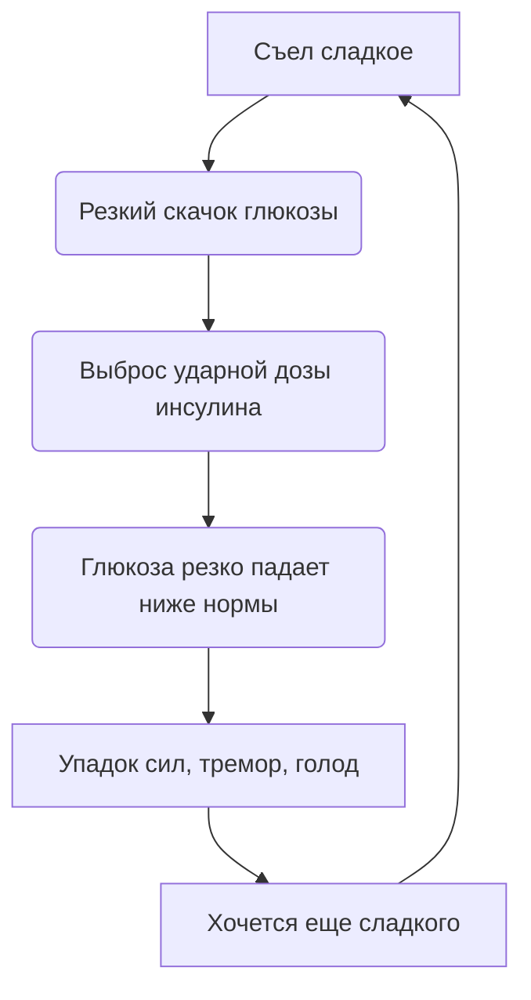

# Сахарные горки: Как сладости вызывают упадок сил через час после еды

Это чувство знакомо каждому: ты съедаешь шоколадку, чтобы взбодриться. Первые 20 минут — ты супергерой. А потом накрывает такая усталость, что хочется лечь прямо на парту и уснуть. Знакомо? Это не магия, это физика твоего тела. Или, точнее, химия.

Ты только что прокатился на «сахарных горках». Аттракцион так себе.

> ### 🛑 Рубрика «Миф vs Реальность»
>
> **1. Про шоколад для мозга**  
> 🔴 *Миф:* «Мозгу нужен сахар, чтобы думать».  
> 🟢 *Реальность:* Мозгу нужна *глюкоза*. Но он получает ее из сложных углеводов (каш, овощей). Шоколад дает переизбыток, после которого наступает откат.
>
> **2. Про энергию**  
> 🔴 *Миф:* «Сладкое дает энергию».  
> 🟢 *Реальность:* Сладкое дает быстрый всплеск, а затем крах. Чистая энергия — это белки и жиры, они горят долго.

## Инсулиновые качели: Анатомия краха

Когда ты съедаешь сладкое (сахар, булку, сок), уровень глюкозы в крови взлетает до небес. Организм пугается: «Это критический уровень! Надо срочно спасаться!»

Поджелудочная железа выбрасывает мощную дозу гормона **инсулина**. Его задача — затолкать глюкозу из крови в клетки, чтобы снизить уровень сахара до безопасного.

Проблема в том, что инсулин действует как слишком ревностный уборщик — он не останавливается вовремя и выметает всё подчистую. В результате через час уровень глюкозы падает **ниже нормы**. Из огня да в полымя.

# Почему это плохо для психики

**«Сахарные горки»** — это не просто про усталость. Это про твое настроение. Исследования показывают, что частые скачки сахара усиливают тревожность и делают эмоции нестабильными.

Когда сахар падает, организм снова думает, что наступила катастрофа (он же не знает, что это ты просто сникерс съел). Он снова выбрасывает **адреналин и кортизол**. Ты становишься раздражительным, злым или плаксивым без причины.

## Типичный день сладкоежки

Вот как выглядит типичный день сладкоежки:

- **10:00** — съел конфету (кайф, глаза горят)
- **10:40** — хочешь спать, бесит училка, бесит сосед по парте
- **11:00** — съел еще конфету (снова кайф)
- **11:45** — рыдаешь над задачей по алгебре, хотя обычно решаешь ее за минуту

**Краткий пересказ:** Сладкое → временный кайф → падение сахара → паника в мозге → тревога и агрессия.

## Чек-лист: Как слезть с сахарных качелей

Если ты замечаешь за собой такую зависимость, попробуй эти лайфхаки:

- **Никогда не ешь сладкое на голодный желудок.** Если хочешь десерт, съешь его ПОСЛЕ нормальной еды (с белками и жирами). Это замедлит всасывание сахара.
- **Добавляй белок к углеводам.** Ешь яблоко не одно, а с горстью орехов. К шоколаду добавь сыр или йогурт. Белок работает как подушка безопасности для твоего сахара.
- **Пей воду.** Обезвоживание часто маскируется под тягу к сладкому и усталость. Иногда достаточно выпить стакан воды, чтобы желание сбежать за шоколадкой исчезло.
- **Засеки время.** Если через 30–60 минут после сладкого тебя вырубает — ты точно на сахарных горках. Попробуй неделю прожить без добавленного сахара и почувствуй разницу.

## 😂 Анекдот от GPT по теме

Разговор двух подростков в столовой:  
— Слыш, дай шоколадку, у меня мозг отключается.  
— Так ты уже третью за сегодня ешь!  
— Вот именно поэтому и отключается. Мне нужна четвертая, чтобы включиться обратно. Замкнутый круг какой-то...

---
**Автор:** Ткаченко Елизавета  
**Нейронные сети, использованные при создании статьи:** OpenAI GPT-4o, Google Gemini 1.5 Pro
